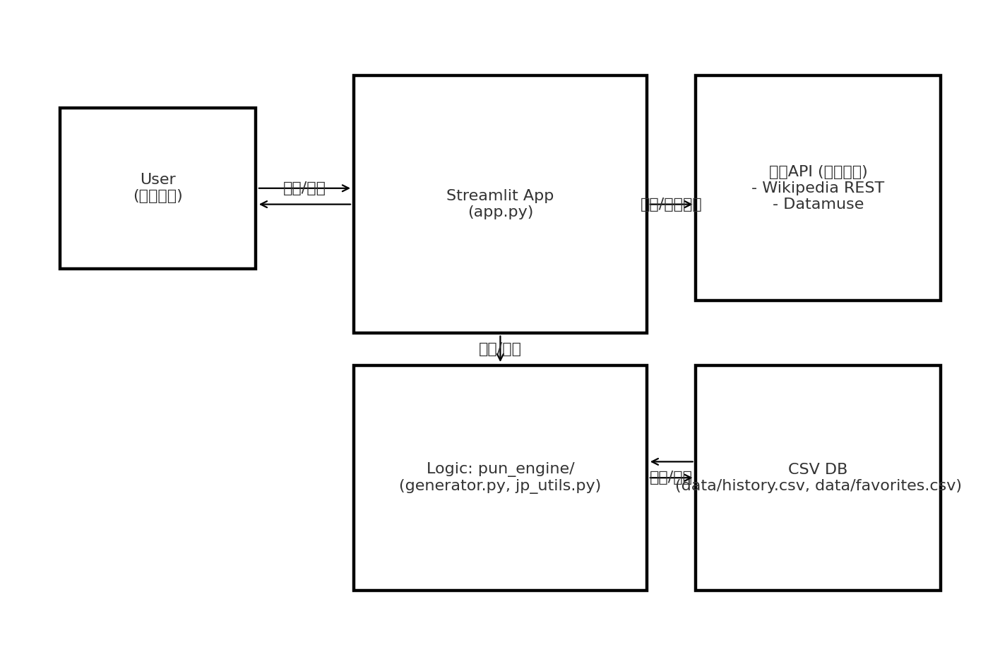
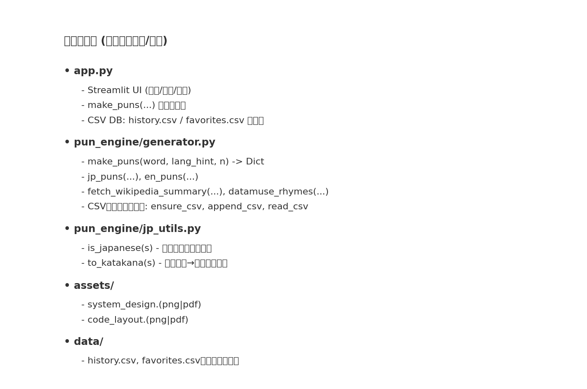

# ダジャレメーカー（Streamlit）

単語を入力するとダジャレ案を生成してくれるアプリです。**APIキー不要**の外部APIのみを使用し、UIコード（`app.py`）とロジックコード（`pun_engine/`）を分離しています。

## アプリ概要

- 入力：単語（日本語/英語）、任意で `.txt` の単語リストをバッチ生成
- 出力：ダジャレ候補（日本語はテンプレ/語呂、英語は韻を使った軽いダジャレ）
- 追加機能（加点対応）：CSVベースの簡易データベース
  - 生成結果を**履歴**・**お気に入り**に保存（`data/history.csv`, `data/favorites.csv`）
  - お気に入りCSVのダウンロード

## 使用しているAPI（いずれも**APIキー不要**）

- Wikipedia REST API（Ja/En）: 用語の要約を取得  
  例: `https://ja.wikipedia.org/api/rest_v1/page/summary/カレー`
- Datamuse API（En）: 韻・近似音の取得  
  例: `https://api.datamuse.com/words?rel_rhy=pizza`

## システム設計図 / コード説明図

- **システム設計図**（自分が使っているソフトウェアや外部サービスの関係図）  
  

- **コード説明図**（全ファイル/主要関数の関係図）  
  

PDF版：
- [assets/system_design.pdf](assets/system_design.pdf)
- [assets/code_layout.pdf](assets/code_layout.pdf)

## ディレクトリ構成

```
.
├── app.py                # Streamlit UI（アプリ本体）
├── pun_engine/           # ロジック一式（API呼び出し/CSV DB/日本語ユーティリティ）
│   ├── __init__.py
│   ├── generator.py
│   └── jp_utils.py
├── assets/               # 図版（システム設計図・コード説明図）
│   ├── system_design.png
│   ├── system_design.pdf
│   ├── code_layout.png
│   └── code_layout.pdf
├── data/                 # 実行時に作成（Streamlit Cloudでも保持される）
│   ├── history.csv
│   └── favorites.csv
├── requirements.txt
└── README.md
```

## ローカル実行

```bash
pip install -r requirements.txt
streamlit run app.py
```

## Streamlit Cloud デプロイ手順

1. GitHubに **public** レポジトリを作成（例：`2301201_山本_AIプログラミング課題2`）。  
2. このプロジェクト一式をコミット&プッシュ。  
3. [Streamlit Community Cloud](https://share.streamlit.io/) にログイン → **New app** → 対象レポジトリ/ブランチを選択 → デプロイ。  
4. デプロイ後に表示されるURLを**提出用コメント**に記入。

## 提出コメントひな形

- アプリURL: （デプロイ後のURL）  
- GitHub URL: （レポジトリURL）  
- 加点の有無: 有り（CSVでDB機能）/無し  
- その他コメント：工夫点や難しかった点など

## 注意事項

- 外部APIは**キー不要**のみ使用（Wikipedia / Datamuse）。
- ダジャレ生成は軽量ヒューリスティック（日本語）と韻ベース（英語）。
- 学内課題につき完全コピペ提出はNG。必要に応じてUI文言やテンプレ、保存仕様など調整してください。
